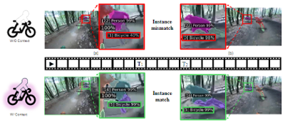
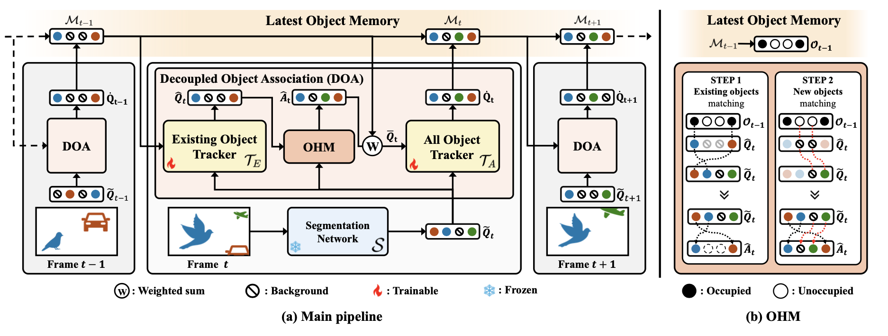
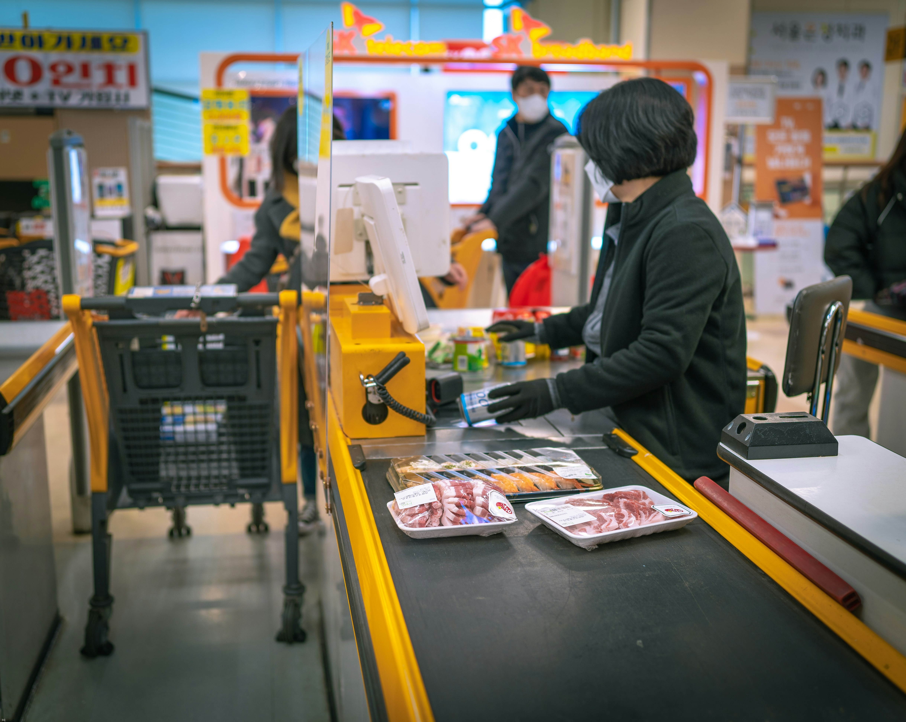








I'm Jiwan Seo, a M.S. student at DGIST(Daegu Gyeongbuk Institute of Science and Technology, Daegu, Republic of Korea). My current research focuses on object-centric video analysis, especially in Video Instance Segmentation(VIS) and Referring Video Object Segmentation(RVOS).
<a href="../Jiwan_Seo_CV.pdf" target="_blank">My CV (PDF)</a>

# 🔥 News
- Currently: &nbsp;Seeking internship or full-time positions.
- *2025.06*: &nbsp;🎉🎉 2 papers accepted to ICCV 2025
 

# 📝 Publications 

ICCV 2025

[CAVIS: Context-Aware Video Instance Segmentation](https://arxiv.org/pdf/2407.03010)

Seunghun Lee*, <b>Jiwan Seo*</b>, Kiljoon Han, Minwoo Choi, Sunghoon Im

[**Project**](https://seung-hun-lee.github.io/projects/CAVIS/) <strong></strong>

ICCV 2025

[LOMM: Latest Object Memory Management for Temporally Consistent Video Instance Segmentation]

Seunghun Lee*, <b>Jiwan Seo</b>, Minwoo Choi, Kiljoon Han, Jaehoon Jeong, Zane Durante, Ehsan Adeli, Sang Hyun Park, Sunghoon Im

[**Project page coming soon**]

Industry project

[Lightweight vision model for retail checkout automation]

DGIST & Ki*** Electronics collaborated work

# 📖 Academic Activities
+ Reviewer
  - 2025, IEEE Robotics and Automation Letters(RA-L)

# 📖 Educations
- *2024.02 - present*, M.S. course, Artificial Intelligence, DGIST
- *2018.03 - 2024.02*, Undergraduate, Computer Engineering, Yeungnam University
