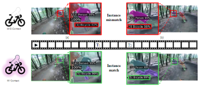
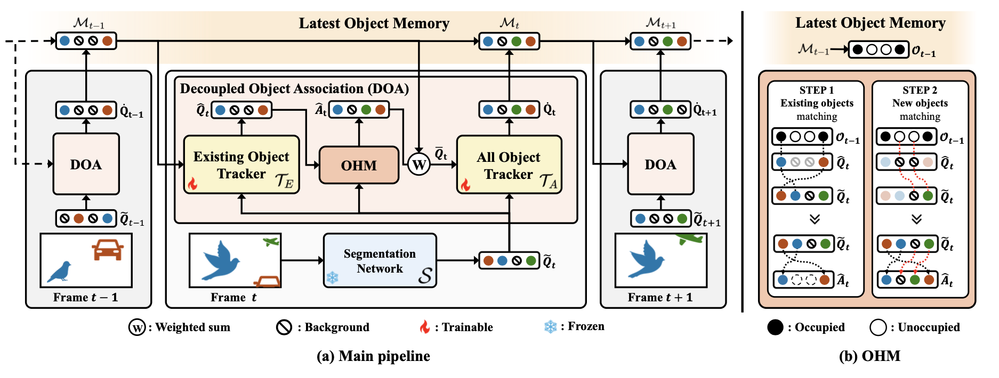
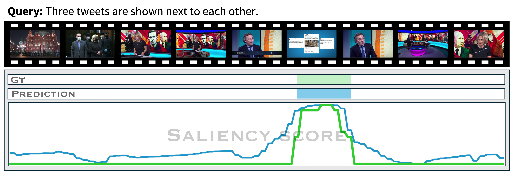
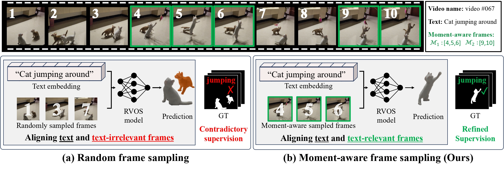
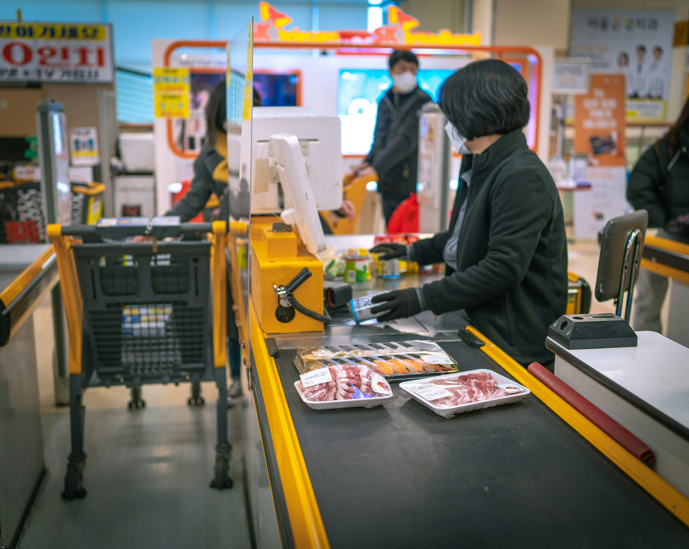








I'm Jiwan Seo, an AI researcher at KETI. 
My research focuses on object-centric video analysis, particularly Video Instance Segmentation (VIS) and Referring Video Object Segmentation (RVOS). 
Currently, I am researching 3D Object Reconstruction and 4D Gaussian Splatting (4DGS).

<a href="../Jiwan_Seo_CV.pdf" target="_blank"><b>My CV </b>(PDF)</a>

# 🔥 News
- *2026.03*: Joined Hologram Research Center, KETI.
- *2026.02*: &nbsp;🎉🎉 1 paper accepted to CVPR 2026

# 📝 Publications 

ICCV 2025

[CAVIS: Context-Aware Video Instance Segmentation](https://arxiv.org/pdf/2407.03010)

Seunghun Lee*, <b>Jiwan Seo*</b>, Kiljoon Han, Minwoo Choi, Sunghoon Im

[**Paper**](https://arxiv.org/abs/2407.03010) \| [**Project**](https://seung-hun-lee.github.io/projects/CAVIS/) \| [**Code**](https://github.com/Seung-Hun-Lee/CAVIS) \| 

ICCV 2025

[LOMM: Latest Object Memory Management for Temporally Consistent Video Instance Segmentation]

Seunghun Lee*, <b>Jiwan Seo</b>, Minwoo Choi, Kiljoon Han, Jaehoon Jeong, Zane Durante, Ehsan Adeli, Sang Hyun Park, Sunghoon Im (DGIST X Stanford)

[**Paper**](https://arxiv.org/abs/2507.19754) \| [**Project**](https://seung-hun-lee.github.io/projects/LOMM/) \| [**Code**](https://github.com/Seung-Hun-Lee/LOMM)

CVPR 2026

[CVA: Context-aware Video-text Alignment for Video Temporal Grounding]

Sungho Moon*, Seunghun Lee*, <b>Jiwan Seo</b>, Sunghoon Im 

Under review

[Temporal Grounding as a Learning Signal for Referring Video Object Segmentation]

Seunghun Lee*, <b>Jiwan Seo*</b>, Jeonghoon Kim*, Siwon Kim, Hyokyung Jeon, Haeun Yoon, Zane Durante, Sang Hyun Park, Sunghoon Im (DGIST X Stanford)

[**Paper**](https://arxiv.org/abs/2507.19754) \| [**Project**](https://seung-hun-lee.github.io/projects/SAMDWICH/) \| [**Code**](https://github.com/Seung-Hun-Lee/SAMDWICH)

# 🖥️ Industrial Projects

Industry project

[Lightweight vision model for retail checkout automation]

DGIST & Ki*** Electronics collaborated work 

(Keywords: Object Detection, Edge Device)

# 📖 Educations
- *2024.03 - 2026.02*, M.S. course, Artificial Intelligence, [DGIST CVLAB](https://cvlab.dgist.ac.kr/)
- *2018.03 - 2024.02*, Undergraduate, Computer Engineering, Yeungnam University

# 📖 Academic Activities
+ Reviewer
  - Reviewer, IEEE Robotics and Automation Letters (RA-L), 2025
+ Workshop
  - Presenter, Human-inspired Computer Vision Workshop, 2025
  - Presenter, Memory and Vision Workshop, 2025

# 📖 Language Skills
+ English
  - *2026.03*, TOEIC 910

<!-- <a href="./wandoo-recruit.html" target="_blank"><b>Wandoo 합격 메일 보기</b></a> -->
